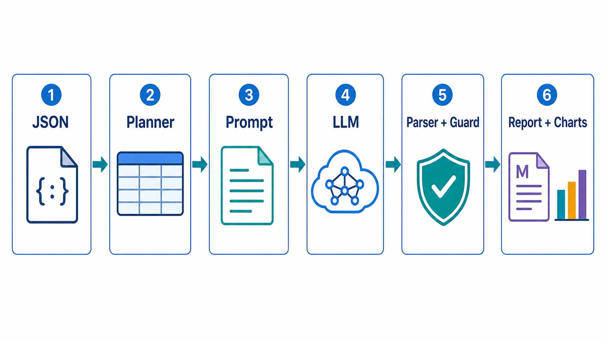

# 当前报告创建流程说明

本文只描述当前源码中的真实流程，不以 README 为准。

## 一图看懂



这张图由 image2 生成，用来说明当前报告生成链路：

```text
本地基金指标 JSON
  -> Planner 整理上下文和图表草案
  -> Prompt 模板填入上下文 JSON
  -> LLM 生成 Markdown 和 chart specs
  -> Parser 拆分输出，Guard 做结构和边界检查
  -> 保存 report.md、chart_specs.json、metadata.json、source_metrics.json
```

## 最核心的一句话

当前系统不是用固定规则给基金打分，而是把结构化指标整理成一份“报告上下文 JSON”，交给大模型一次性生成：

- Markdown 报告正文
- 图表配置 JSON

后端再把这两部分解析、检查并保存。

## 后端实际执行链路

真正串起报告生成的是 `src/fundinsight/report_agent.py`：

```python
fund_metrics = load_fund_metrics(input_path)
report_plan = build_report_plan(fund_metrics)
template = load_prompt_template(self.prompt_template_path)
prompt = render_prompt(template, report_plan)
raw_output = llm_client.generate(prompt)
parsed_output = parse_report_output(raw_output)
guard_result = check_report(...) + check_chart_specs(...)
```

直观理解如下：

1. `load_fund_metrics`
   读取一个本地 JSON 文件，并用 Pydantic 校验字段结构。

2. `build_report_plan`
   不写最终报告，只整理材料：原始指标、派生指标、指标表格、图表草案、缺失字段、分析重点。

3. `render_prompt`
   把 `ReportPlan` 转成 JSON，填进 `prompts/fund_report_prompt.md` 的 `{{report_context_json}}`。

4. `llm_client.generate`
   调用百炼兼容 OpenAI Chat Completions 的接口，默认模型是 `deepseek-v4-flash`。

5. `parse_report_output`
   从大模型返回内容中拆出 `<report_markdown>` 和 `<chart_specs_json>`。

6. `report_guard`
   检查必需章节、禁止投顾表达、图表占位和图表 JSON 是否匹配。

7. `ReportStore`
   API 任务会把结果保存到 `reports/funds/{fund_code}/`。

## 大模型输入是什么

大模型收到的不是原始 JSON 本身，而是一份包含指令和上下文的完整 prompt。

prompt 末尾嵌入的上下文大致长这样：

```json
{
  "source_metrics": {
    "fund": "...",
    "metrics": "...",
    "data_quality": "..."
  },
  "derived_metrics": {
    "computed_excess_return_1y": "...",
    "reported_excess_return_1y": "...",
    "fee_total": "...",
    "asset_position_total": "..."
  },
  "metric_tables": {
    "return_periods": [],
    "benchmark_comparison": [],
    "risk_profile": [],
    "peer_summary": []
  },
  "chart_specs": [],
  "analysis_focus": [],
  "missing_fields": [],
  "data_notes": []
}
```

这里的 `chart_specs` 是 planner 先生成的图表草案，用来告诉模型应该围绕哪些图表组织正文和输出图表配置。

## 大模型必须返回什么

prompt 要求模型只返回两个标签：

```xml
<report_markdown>
这里是完整 Markdown 报告
</report_markdown>

<chart_specs_json>
这里是合法 JSON 图表配置
</chart_specs_json>
```

如果模型没有这两个标签，或者 `chart_specs_json` 不是合法 JSON，解析会失败。

## 图表是怎么来的

图表不是 Python 直接画出来的。

当前流程是：

1. `report_planner` 先准备 6 个图表草案：
   `returns_by_period`、`benchmark_excess_return_1y`、`risk_drawdown_profile`、`risk_adjusted_metrics`、`asset_allocation_profile`、`peer_context`。

2. 大模型在 Markdown 中写图表占位：

```markdown
<!-- chart: returns_by_period -->
图表解读：这里解释这张图说明了什么。
```

3. 大模型同时在 `chart_specs_json` 中输出同名图表配置：

```json
{
  "id": "returns_by_period",
  "title": "多周期收益表现",
  "type": "bar",
  "source_fields": ["metrics.performance.return_1m"],
  "series": [
    {
      "name": "基金收益",
      "values": [
        { "period": "1M", "value": 0.018 }
      ]
    }
  ],
  "encoding": { "x": "period", "y": "value" },
  "x_axis": "观察周期",
  "y_axis": "收益率",
  "value_unit": "decimal_percent",
  "notes": ["用于观察不同时间窗口的历史收益形态。"]
}
```

4. `report_guard.check_chart_specs` 检查：
   Markdown 里的 `chart_id` 和 JSON 里的 `id` 必须一致，不能少、不能多、不能重复。

5. 前端读取 `chart_specs.json` 后渲染图表：
   `pie` 渲染成 SVG 饼图，`bar` 渲染成条形图，`line` 目前还是预留占位。

## 报告文件是怎么保存的

API 生成成功后，`ReportStore.save_generated_report` 会保存四类文件：

```text
reports/funds/{fund_code}/
  report.md
  chart_specs.json
  source_metrics.json
  metadata.json
```

各文件含义：

- `report.md`: 大模型输出的 Markdown 正文。
- `chart_specs.json`: 大模型输出并通过 schema 校验的图表配置。
- `source_metrics.json`: 生成报告时使用的原始指标 JSON。
- `metadata.json`: 报告 ID、创建时间、guard 是否通过、guard 问题列表。

## 前端在流程中的角色

前端不生成报告，也不调用大模型。

前端只做三件事：

1. 在创建页选择基金代码，调用 `/api/reports/ensure`。
2. 如果后端创建异步任务，前端轮询 `/api/report-tasks/{task_id}`。
3. 报告完成后读取 `/api/reports/{report_id}`，展示 Markdown、核心指标、guard 状态和图表区域。

当前还有一个细节：Markdown 正文里的 `<!-- chart: ... -->` 会被 `MarkdownReportViewer` 跳过；实际图表集中显示在报告详情页的“图表区域”。

## 当前流程的边界

当前系统做的是报告生成和结构检查，不做这些事：

- 不给基金打分。
- 不做买入、卖出、持有等投顾建议。
- 不用固定权重公式判断基金好坏。
- 不预测未来收益。
- 不用 guard 判断基金质量，只检查格式、安全边界和图表一致性。
